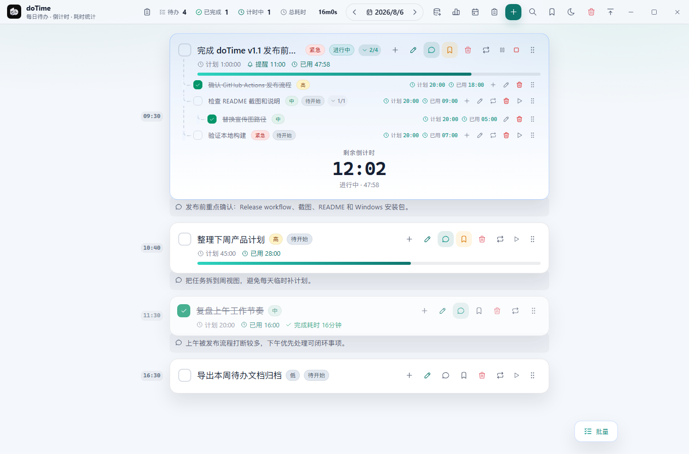
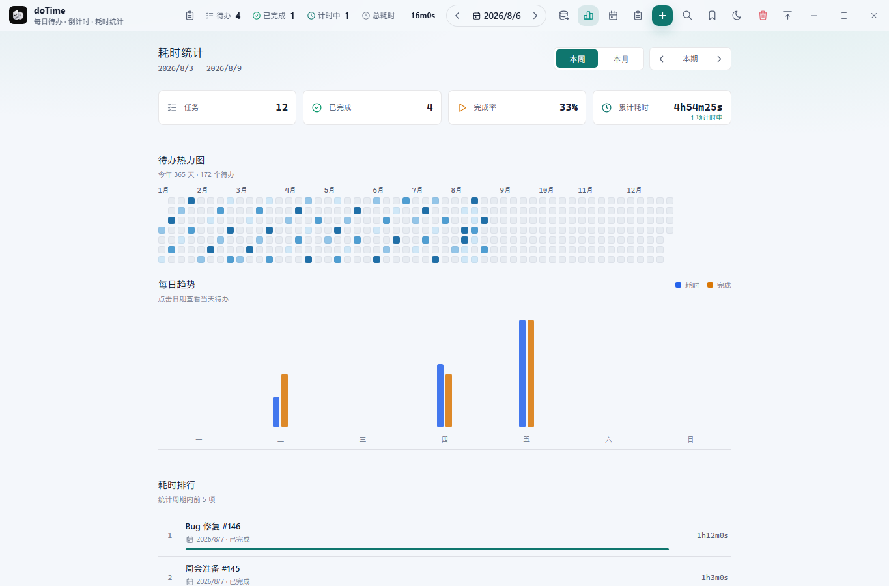
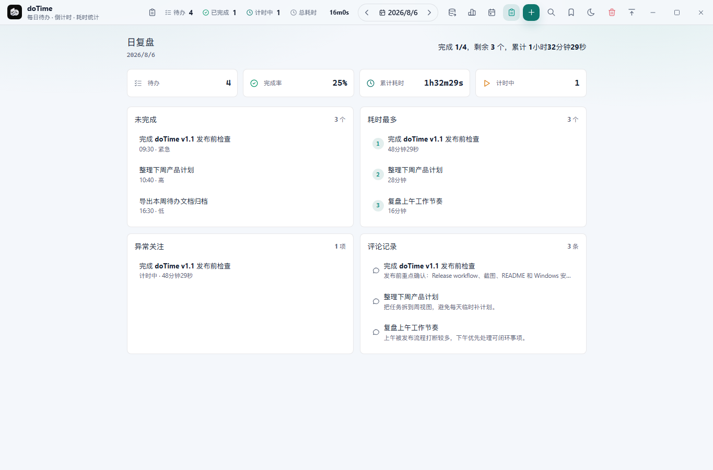
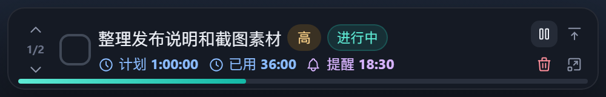

# doTime

doTime 是一款基于 **Tauri 2 + React 19 + TypeScript** 的本地桌面待办与计时应用。它把每日待办、倒计时、耗时统计、计划视图、日复盘、搜索、收藏、模板和本地数据导出放在一个轻量窗口里，适合需要持续跟踪工作节奏的人。

## 每日待办与倒计时



按日期管理任务，支持紧急程度、任务时间、倒计时、提醒、评论、收藏、子待办和拖拽排序。多个待办可以同时计时，完成任务时会结算实际耗时。

## 耗时统计与待办热力图



按周或按月查看任务数、完成率、累计耗时、每日趋势和耗时排行。年度热力图从 1 月开始展示全年待办密度，方便快速回看长期投入分布。

## 周计划与月计划


计划视图把待办按周或自然月铺开，直接展示每天的待办数量、完成情况和关键任务。点击日期可以跳回对应日期的待办列表。

## 日复盘



日复盘会汇总当天的完成率、累计耗时、进行中任务、未完成任务、耗时最多任务、异常关注项和评论记录，适合收工前快速整理一天的执行情况。

## 待办提醒


每个待办都能单独设置提醒时间，支持编辑时快速开启提醒、选择时分并在到点后弹出提醒窗口。

## 全局搜索


跨日期搜索待办，支持按状态、紧急程度和日期范围筛选。点击搜索结果可以跳转到对应日期并高亮目标待办。

## 顶部迷你模式



把当前未完成待办收进窗口顶部，始终显示任务标题、进度、计时和操作按钮，适合专注执行时快速查看当前任务。

## 功能亮点

- 每日待办：按日期组织任务，支持手动拖拽排序
- 倒计时与计时：支持计划时长、实际耗时、多个任务同时计时
- 子待办：支持两级子待办，适合拆解复杂任务
- 评论与收藏：为任务保留复盘备注，收藏重点待办并快速跳转
- 批量操作：批量完成、移动日期、删除、取消收藏
- 任务模板：保存常用任务设置，快速创建重复工作项
- 重复任务：支持每天、工作日、每周指定星期、每月指定日期
- 定时提醒：支持自定义提醒时间和稍后提醒
- 迷你模式：窗口置顶、透明度调节、顶部自动收起
- 数据管理：导出当前日期或全部日期的 TXT 待办文档
- 本地优先：主数据保存在本机 localStorage，不依赖远程服务

## 数据说明

doTime 不依赖 MySQL、PostgreSQL、SQLite 等数据库，也不需要安装额外的数据服务。

- 主数据使用版本化的浏览器 `localStorage` 文档保存
- 主数据损坏时会尝试从最近 3 份有效快照恢复
- 提醒窗口只发送提醒操作，由主窗口统一更新待办
- “导出当日”跟随当前选中的日期；“导出全部”包含所有日期
- 导出文件为 UTF-8 TXT 文档，适合阅读和归档
- 应用数据只保存在当前电脑和当前系统用户目录中

## 开发

```bash
npm install
npm run tauri:dev
```

仅运行浏览器预览：

```bash
npm run dev
```

## 验证

```bash
npm test
npm run build

cd src-tauri
cargo fmt --check
cargo clippy --all-targets --all-features -- -D warnings
```

## 构建

```bash
npm run tauri:build
```

## 技术栈

| 层 | 技术 |
| --- | --- |
| 桌面壳 | Tauri 2 |
| 前端 | React 19 + TypeScript + Vite |
| 图标 | Tabler Icons |
| 状态与数据 | React Hooks + 版本化 localStorage |
| 测试 | Vitest + Cargo Clippy |
